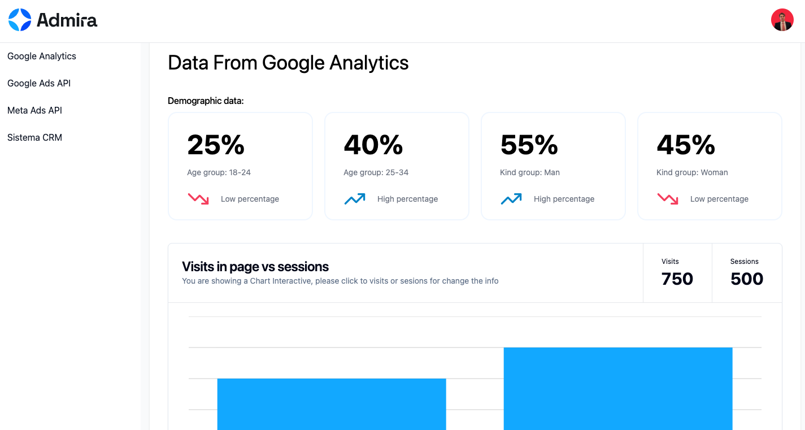
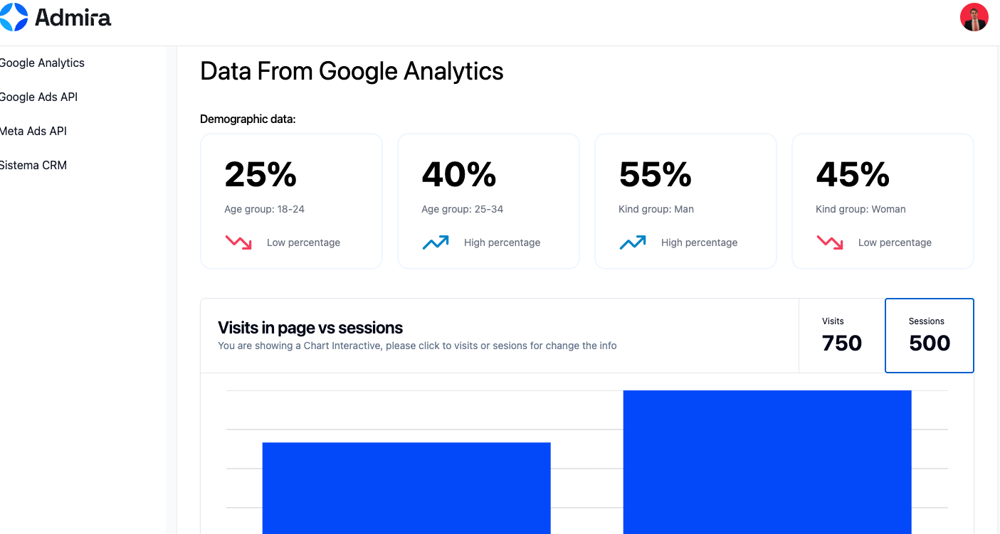
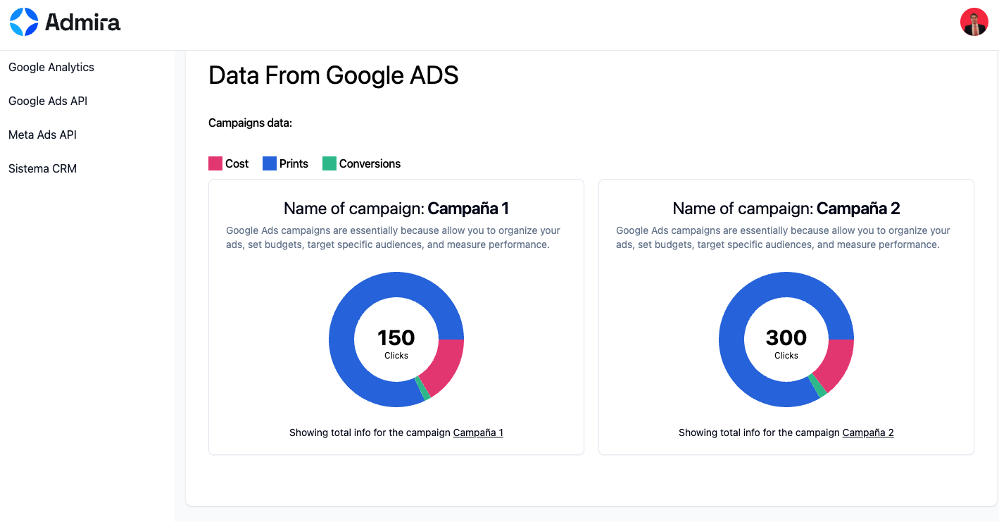
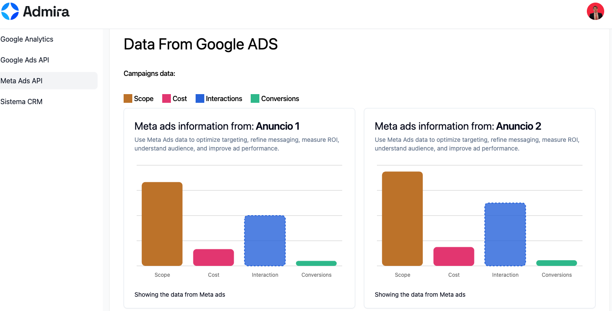
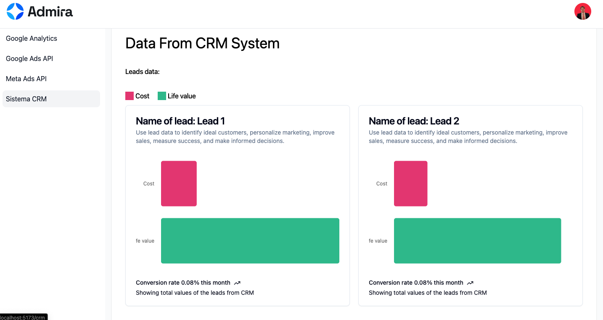

# Admira Dashboard

I have been using react with ts in this project

## Live demo

You can access in the next link: [https://admira.vercel.app](https://admira.vercel.app)

## Characteristics of My Project

Previously, I asked the question: ***How to present dynamic information??*** ...
The answer was to use charts.

- The first step was understand the problem
- The second steps was start the boilerplate:
  - Initialize a vite project with react and ts
  - config the router
  - add tailwind and shadcn
- Finally I began coding.

## Screenshots

